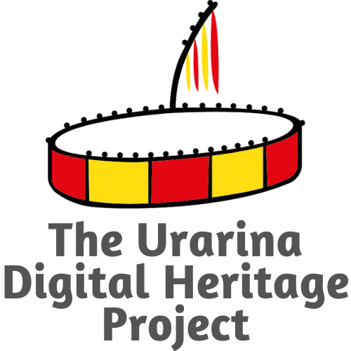

{: width="250" style="float:left; padding:16px"} 
  
&nbsp;
&nbsp;
&nbsp;

 "The study of the past is more than the study of ancient people, artefacts, events and processes. At a broader behavioural level it is about the relationship between people, material objects, processes, and space or place."    
 -- (Papadopoulos & Urton (2012), The construction of value in the ancient past).
&nbsp;

---
     
  
This project supports the  effort of the Urarina people to preserve their cultural heritage and knowledge. 

It is is committed to decolonization in digital knowledge production.

More information about the Urarina Heritage Project can be found here.

This pilot project has been supported by the [Center for Latin American and Caribbean Studies](https://clacs.ku.edu/) at the University of Kansas.

