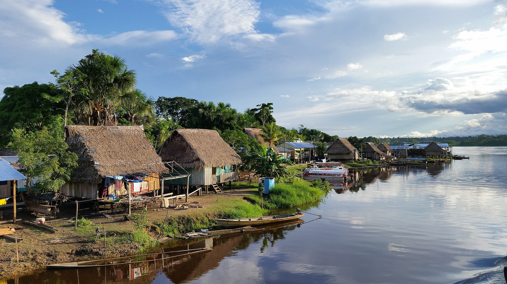
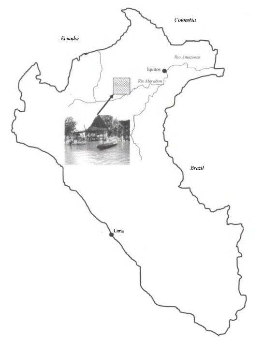
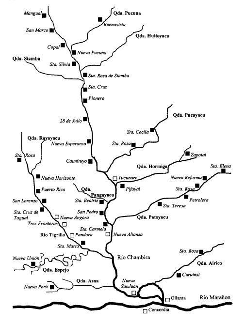

---
layout: page
title:  Welcome to the world of the Urarina
---

[![Urarina Territory Picture][5]{: width='800'}][6]

   [5]:  assets/img/panoramio_3.jpg
   [6]:  assets/img/panoramio_2.jpg "Urarina Picture"

 

Los Urarina son un pueblo indígena de la cuenca del Amazonas que vive en los valles de los ríos Chambira, Urituyacu y Corrientes en el departamento de Loreto en Perú. Según fuentes arqueológicas, históricas y relatos orales, los Urarina han residido en la cuenca de Chambira en el noreste del Perú contemporáneo desde siglos. Originalmente vivían en casas comunales en  las orillas del río Chambira y sus afluentes. Hoy en día, la mayoría de la gente vive en casas individuales más pequeñas.

 

[![Urarina Territory Map][1]{: width='300' align='left' }][2]

   [1]:  assets/img/map_ura.png
   [2]:  assets/img/map_ura.png "Urarina teritory"

El pueblo Urarina se reconoce bajo el término urarinaaürü, que significa 'pueblo'. En quechua, el término se traduce como urayruna, uray significa "abajo" y runa es el marcador plural en el idioma, por lo que el término significa "la gente de abajo, es decir, río abajo".

  El Ministerio de Cultura de Perú calcula la población de Urarina en 5.802 personas. La mayoría de los Urarina siguen un estilo de vida semimóvil y subsisten de la caza, la pesca y los cultivos alimentarios. La caza común son mamíferos como tapires, pacas, monos, así como aves y cocodrilos. Para pescar se emplean diferentes métodos: con redes, arpones o anzuelos (tradicionalmente con la espina de la liana garabata), o envenenando una fracción del río. La yuca (Urarina laano) es uno de los cultivos básicos más comunes, junto con el plátano y el urari, un tubérculo que se consume asado, frito o como ingrediente de sopa. También se pueden cultivar frutas como plátanos pequeños y papaya. Las Urarina cuentan con pequeños jardines que rodean la casa y jardines más grandes ubicados a una distancia de varias horas de caminata.

 

[![Urarina Villiage Map][3]{: width='300' align='right' }][4]

   [3]:  assets/img/map_chambi.png
   [4]:  assets/img/map_chambi.png "Urarina village"

El estilo de vida exige que los Urarina fabriquen cerbatanas, dardos, hamacas para bebés, colchonetas, vasijas de barro, cucharas de madera, cestas, collares y bolsos. La fibra extraída de la palma chambira o de la palma aguaje se utiliza para todo tipo de tejidos.

Existe una división del trabajo basada en el género con respecto a algunos aspectos de la vida, pero muchas veces el trabajo es compartido. Por ejemplo, hombres y mujeres se ocupan del jardín. Las tareas del jardín son múltiples, desde talar árboles y limpiar y quemar la maleza hasta cortar malezas, sembrar y cosechar. Las tareas pesadas, como la tala de árboles, suelen ser realizadas por hombres. La caza y la pesca son actividades masculinas, pero las mujeres pueden acompañar a sus maridos a los cotos de caza, en cuyo caso ellas cocinan. Cocinar es responsabilidad de las mujeres, al igual que cuidar a los niños. Las mujeres se encargan de elaborar artículos tejidos, pero los hombres se dedican a la fabricación de cestas, armas y herramientas.

La espiritualidad urarina involucra tres personajes importantes:
1. am kwaaunera, el Creador de todas las cosas. El Creador es un ser benevolente.
2. kam kwaaunera letono el enviado del Creador, un espíritu con forma humana. Es malévolo e intenta traicionar a la gente creando todo tipo de dificultades y situaciones traicioneras.
3. Lomai 'Dios Madre' reside en un terreno mágico, rodeado de muchos seres espirituales. Lomai impone reglas estrictas y la desobediencia resulta en castigo.

## Explora y disfruta el mundo de los Urarina a través de la lente de sus artefactos.

{: width="550" } | {: width="250" } {: width="250" }

